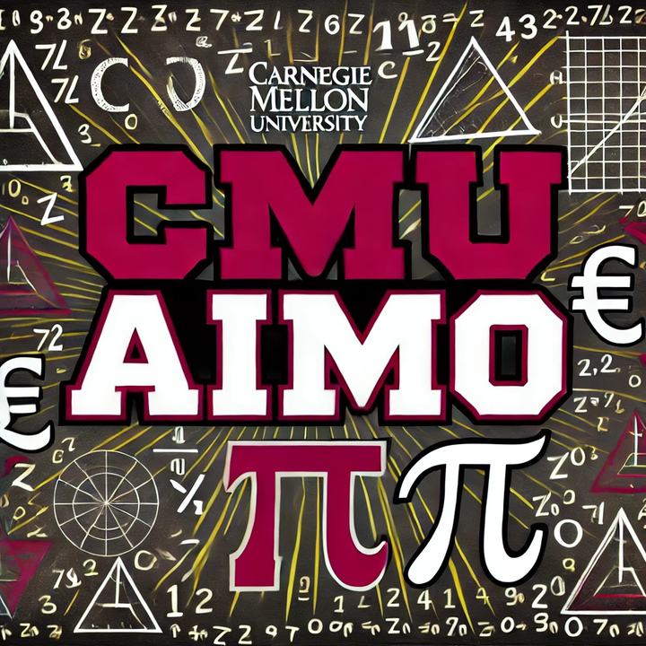

# AIMO-CMU_MATH
Welcome to the official GitHub repository of the CMU_Math team, the proud winners of the **2nd place** in the **AI Mathematical Olympiad (AIMO)**.

We are pleased to share all the datasets and code used in our competition. This repository contains the resources needed to reproduce our models and solutions.

We hope these resources will be beneficial for your research and preparation for the next round of AIMO.

Thank you for your interest and support!

## Content:
- **Problem Dataset** The processed dataset (AIME, AMC, Odyssey-Math)
- **Validation Set** The dataset we used for validation.
- **Policy Model Train Dataset**
- **Reward Model Train Dataset**
- **Data Collection Scripts** The scripts to sample GPT4 solutions and reward model dataset.
- **Fine-tune Scripts** The code we used for full parameter fine-tuning, adapted from gpt-fast.

